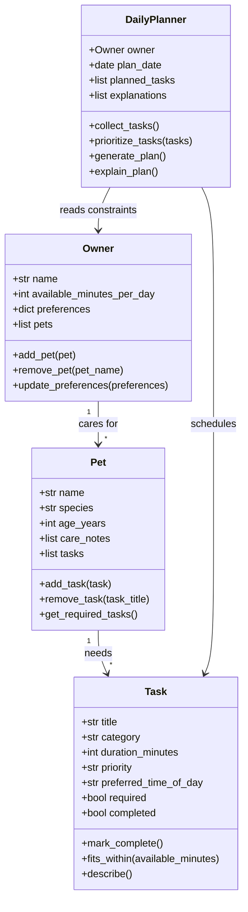

# PawPal+ Project Reflection

## 1. System Design

Before drafting the classes, I identified three core actions PawPal+ should support:

- A pet owner should be able to create or update a pet profile so the app knows which animal needs care and what kind of care matters most.
- A pet owner should be able to add and edit care tasks such as walks, feeding, medication, grooming, or enrichment with enough detail to schedule them well.
- A pet owner should be able to generate today's plan and quickly understand why each task was selected and ordered the way it was.

**a. Initial design**

I started with four classes: `Owner`, `Pet`, `Task`, and `DailyPlanner`.

- `Owner` holds the owner's name, available minutes for the day, preferences, and the list of pets they are responsible for. Its main job is to manage pet relationships and capture scheduling constraints from the human side.
- `Pet` holds pet-specific details such as name, species, age, care notes, and the tasks that belong to that pet. Its responsibility is to organize care needs at the pet level.
- `Task` represents an individual care activity. It stores the task title, category, duration, priority, preferred time of day, whether it is required, and whether it has been completed. Its responsibility is to describe one schedulable unit of work.
- `DailyPlanner` acts as the scheduling engine. It gathers tasks across pets, prioritizes them using owner constraints, generates the daily plan, and provides short explanations for the chosen schedule.

Mermaid UML draft:

**b. Design changes**

After an AI review of the skeleton, I made two small design changes. I added `available_minutes_per_day` to `Owner` so the planner has an explicit daily time constraint instead of treating time as a vague preference. I also added `preferred_time_of_day` and `required` to `Task` so the system can better separate must-do care, like medication, from flexible tasks, like enrichment. Those changes made the model clearer and reduced the chance that too much hidden logic would get pushed into `DailyPlanner`.

---

## 2. Scheduling Logic and Tradeoffs

**a. Constraints and priorities**

- What constraints does your scheduler consider (for example: time, priority, preferences)?
- How did you decide which constraints mattered most?

**b. Tradeoffs**

- Describe one tradeoff your scheduler makes.
- Why is that tradeoff reasonable for this scenario?

---

## 3. AI Collaboration

**a. How you used AI**

- How did you use AI tools during this project (for example: design brainstorming, debugging, refactoring)?
- What kinds of prompts or questions were most helpful?

**b. Judgment and verification**

- Describe one moment where you did not accept an AI suggestion as-is.
- How did you evaluate or verify what the AI suggested?

---

## 4. Testing and Verification

**a. What you tested**

- What behaviors did you test?
- Why were these tests important?

**b. Confidence**

- How confident are you that your scheduler works correctly?
- What edge cases would you test next if you had more time?

---

## 5. Reflection

**a. What went well**

- What part of this project are you most satisfied with?

**b. What you would improve**

- If you had another iteration, what would you improve or redesign?

**c. Key takeaway**

- What is one important thing you learned about designing systems or working with AI on this project?
