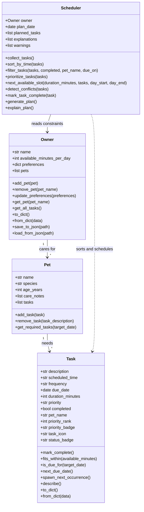

# PawPal+ Project Reflection

## 1. System Design

Before drafting the classes, I identified three core actions PawPal+ should support:

- A pet owner should be able to create or update a pet profile so the app knows which animal needs care and what kind of care matters most.
- A pet owner should be able to add and edit care tasks such as walks, feeding, medication, grooming, or enrichment with enough detail to schedule them well.
- A pet owner should be able to generate today's plan and quickly understand why each task was selected and ordered the way it was.

**a. Initial design**

I started with four classes: `Owner`, `Pet`, `Task`, and `DailyPlanner`.

- `Owner` holds the owner's name, available minutes for the day, preferences, and the list of pets they are responsible for. Its main job is to manage pet relationships and capture scheduling constraints from the human side.
- `Pet` holds pet-specific details such as name, species, age, care notes, and the tasks that belong to that pet. Its responsibility is to organize care needs at the pet level.
- `Task` represents an individual care activity. It stores the task title, category, duration, priority, preferred time of day, whether it is required, and whether it has been completed. Its responsibility is to describe one schedulable unit of work.
- `DailyPlanner` acts as the scheduling engine. It gathers tasks across pets, prioritizes them using owner constraints, generates the daily plan, and provides short explanations for the chosen schedule.

Final Mermaid UML after implementation:

I also saved this final version as `uml_final.png` in the project folder so the diagram is available as an image as well as Mermaid text.

**b. Design changes**

After implementation, I made two useful design changes. First, I renamed `DailyPlanner` to `Scheduler` because that name better matches its job as the part of the system that retrieves, sorts, and manages tasks across pets. Second, I added an `Owner.get_all_tasks()` method so the scheduler can ask the owner for a single combined task list instead of reaching into each pet directly. That made the relationship between the classes cleaner and reduced coupling.

I also expanded `Task` to include `due_date` and recurring-task helpers such as `next_due_date()` and `spawn_next_occurrence()`. That let me keep recurrence rules close to the task data itself instead of burying all of that logic inside the scheduler.

---

## 2. Scheduling Logic and Tradeoffs

**a. Constraints and priorities**

My scheduler considers the owner's available minutes for the day, each task's due date, whether the task is already completed, the scheduled time, and the task priority. It also supports filtering by pet name and completion status so the owner can focus on a subset of work instead of the entire household at once.

I treated available time, due date, and priority as the most important constraints because they decide whether a task belongs in today's plan and how urgent it should feel. In the final version, priority comes before time so high-impact tasks like medication can rise to the top even if they were entered later in the day. I also added a next-available-slot helper so the scheduler can suggest where a task might fit when time gets tight.

**b. Tradeoffs**

One tradeoff my scheduler makes is that conflict detection only checks for exact time matches, like two tasks both scheduled at 7:00 AM, instead of trying to calculate overlapping durations. That is a simpler rule than a full calendar system, but it is reasonable for this project because it still surfaces obvious scheduling problems quickly without adding a lot of complexity to the first version of the app.

---

## 3. AI Collaboration

**a. How you used AI**

VS Code Copilot was most helpful for design brainstorming, small algorithm suggestions, and test planning. I used it to think through the class structure early, suggest clean sorting and filtering approaches, and generate candidate edge cases for recurrence, persistence, and conflict detection.

The prompts that worked best were narrow and concrete. Questions like "How should the Scheduler retrieve all tasks from the Owner's pets?" or "What edge cases matter for daily recurrence?" led to better suggestions than broad prompts like "Build my whole app." Separate chat sessions for design, persistence, algorithm work, and testing also helped me keep each Copilot conversation focused on one kind of decision at a time.

Agent Mode was especially effective for the persistence challenge because it let me isolate the JSON-loading and JSON-saving work from the rest of the scheduling changes. That made it easier to reason about serialization separately from UI behavior and algorithm design.

**b. Judgment and verification**

One AI suggestion I chose not to follow all the way was to build more complex overlap-based conflict detection using task durations. That version was more powerful, but it also would have added more calendar logic than this project needed. I kept the simpler exact-time conflict rule because it was easier to explain, easier to test, and still useful to a pet owner.

I evaluated AI suggestions by reading the code carefully, checking whether the design still felt clean, and then verifying behavior with `main.py`, the Streamlit UI, and the pytest suite. If a suggestion increased complexity without making the user experience meaningfully better, I simplified it.

---

## 4. Prompt Comparison

I could not run Claude or Gemini in this workspace, so I compared two OpenAI models instead: `gpt-5.4-mini` and `gpt-5.2`. I asked both the same question about how to handle weekly-task rescheduling in a Python app built around `Task`, `Pet`, `Owner`, and `Scheduler`.

Both answers were useful, but `gpt-5.4-mini` gave the more modular response. It clearly separated recurrence math, scheduler actions, pet ownership, and persistence boundaries, while `gpt-5.2` gave a slightly more compact answer that was still solid but less explicit about architectural boundaries.

I kept the structure that matched the `gpt-5.4-mini` advice because it felt more Pythonic for this codebase. The final design keeps recurrence helpers on `Task`, completion flow on `Scheduler`, pet lookup on `Owner`, and JSON conversion on the data classes instead of hiding that logic in a single utility layer.

---

## 5. Testing and Verification

**a. What you tested**

I tested task completion, adding tasks to pets, priority-first sorting, filtering by pet and status, daily recurrence, weekly recurrence, exact-time conflict warnings, next available slot suggestions, JSON persistence, and the case where pets exist but no tasks have been added yet.

These tests mattered because they cover the scheduler's main promises. If sorting is wrong, the daily plan feels confusing. If recurrence is wrong, repeated care like medication becomes unreliable. If persistence fails, the app stops feeling like a real assistant because it forgets the household between runs. If conflict warnings fail, the owner could miss obvious schedule problems.

**b. Confidence**

I am fairly confident that the scheduler works correctly for the main project goals. Based on the current test suite and the successful manual runs, I would rate my confidence as 4 out of 5.

If I had more time, I would test overlapping durations instead of only exact time matches, multi-day planning behavior with many recurring tasks, corrupted JSON recovery, invalid time formats, and cases where many tasks compete for a very small time budget.

---

## 6. Reflection

**a. What went well**

I am most satisfied with the way the scheduler logic and the Streamlit UI ended up reinforcing each other. The same sorting, filtering, conflict-warning, and recurrence methods power both the backend behavior and what the user actually sees on screen.

**b. What you would improve**

In another iteration, I would redesign recurring tasks as templates plus generated task instances. That would make it easier to manage a long history of completed tasks without mixing them directly into the same list as future tasks.

**c. Key takeaway**

My biggest takeaway is that working with powerful AI still requires a human lead architect. Copilot was great at producing options, sketches, and test ideas, but I had to decide which abstractions to keep, which tradeoffs were acceptable, and when a simpler design was better than a more impressive one.

Using separate chat sessions for design, implementation, algorithm work, and testing also helped me stay organized. Each phase had a clear goal, and that made it easier to judge AI suggestions in the right context instead of letting one conversation become a cluttered mix of unrelated decisions.
